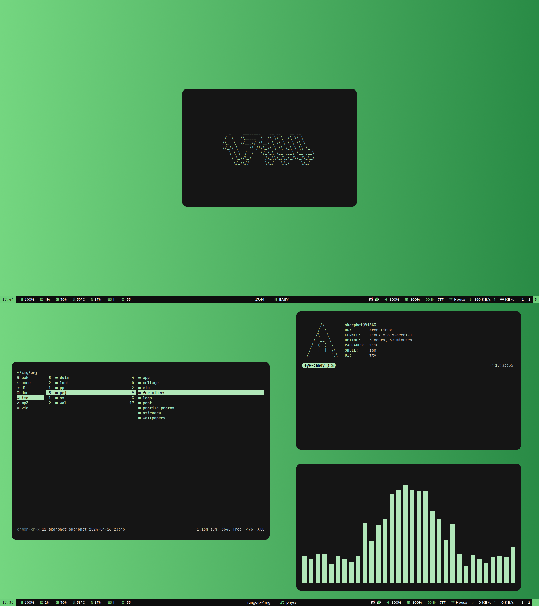

# 🎨 Dotfiles

This repository contains my personal dotfiles for configuring various programs and tools on my Linux system.

## Programs and Tools

- **Window Manager**: [bspwm](https://github.com/baskerville/bspwm)
- **Terminal**: [Alacritty](https://github.com/alacritty/alacritty)
- **Notification Daemon**: [Dunst](https://dunst-project.org/)
- **Version Control**: [Git](https://git-scm.com/)
- **Wallpaper Setter**: [feh](https://feh.finalrewind.org/)
- **Media Player**: [mpv](https://mpv.io/)
- **Text Editor**: [Neovim](https://neovim.io/)
- **Compositor**: [Picom](https://github.com/yshui/picom)
- **Status Bar**: [Polybar](https://github.com/polybar/polybar)
- **File Manager**: [Ranger](https://github.com/ranger/ranger)
- **Application Launcher**: [Rofi](https://github.com/davatorium/rofi)
- **Hotkey Daemon**: [sxhkd](https://github.com/baskerville/sxhkd)
- **Shell**: [Zsh](https://www.zsh.org/)

## Screenshots



## Related Reddit Posts

- [[bspwm] oh the good old days (i wasn't even born yet)](https://www.reddit.com/r/unixporn/comments/1at1233/bspwm_oh_the_good_old_days_i_wasnt_even_born_yet/?utm_source=share&utm_medium=web3x&utm_name=web3xcss&utm_term=1&utm_content=share_button) - [archive](https://web.archive.org/web/20240217125536/https://old.reddit.com/r/unixporn/comments/1at1233/bspwm_oh_the_good_old_days_i_wasnt_even_born_yet/)
- [[bspwm] mavi mavi masmavi](https://www.reddit.com/r/LinuxTurkey/s/XEvvz5FsnA) (2024-02-02) - [archive](https://web.archive.org/web/20240210011105/https://www.reddit.com/r/LinuxTurkey/comments/1ahegun/bspwm_mavi_mavi_masmavi/?share_id=NEjMQ2_aazNRAlrKfH-TD&utm_content=2&utm_medium=android_app&utm_name=androidcss&utm_source=share&utm_term=1&rdt=55197)
- [[bspwm] boring enough?](https://www.reddit.com/r/unixporn/comments/19d0jo0/bspwm_boring_enough/) (2024-01-22) - [archive](https://web.archive.org/web/20240126230311/https://old.reddit.com/r/unixporn/comments/19d0jo0/bspwm_boring_enough/)
- [[bspwm] sub hayırlı olsun rice'ı](https://www.reddit.com/r/archlinuxturkiye/comments/1923kdu/bspwm_sub_hay%C4%B1rl%C4%B1_olsun_rice%C4%B1/) (2024-01-09) - [archive](https://web.archive.org/web/20240126230850/https://old.reddit.com/r/archlinuxturkiye/comments/1923kdu/bspwm_sub_hay%C4%B1rl%C4%B1_olsun_rice%C4%B1/)
- [[bspwm] i must not fear](https://www.reddit.com/r/unixporn/comments/qep42t/bspwm_i_must_not_fear/) (2021-10-24) - [archive](https://web.archive.org/web/20211024095902/https://old.reddit.com/r/unixporn/comments/qep42t/bspwm_i_must_not_fear/)
- [[bspwm] greenery](https://www.reddit.com/r/unixporn/comments/ph3w4x/bspwm_greenery/) (2021-09-03) - [archive](https://web.archive.org/web/20210903120932/https://old.reddit.com/r/unixporn/comments/ph3w4x/bspwm_greenery/)
- [[bspwm] give me tips about my bar, i can't find anything to change about it](https://www.reddit.com/r/unixporn/comments/pcv5xf/bspwm_give_me_tips_about_my_bar_i_cant_find/) (2021-08-27) - [archive](https://web.archive.org/web/20210827201553/https://old.reddit.com/r/unixporn/comments/pcv5xf/bspwm_give_me_tips_about_my_bar_i_cant_find/)
- [[bspwm] same rice? again?](https://www.reddit.com/r/unixporn/comments/p30ms3/bspwm_same_rice_again/) (2021-08-12) - [archive](https://web.archive.org/web/20210812141143/old.reddit.com/r/unixporn/comments/p30ms3/bspwm_same_rice_again/)
- [[bspwm] orange](https://www.reddit.com/r/unixporn/comments/nkl0fe/bspwm_orange/) (2021-05-25) - [archive](https://web.archive.org/web/20210525084927/https://old.reddit.com/r/unixporn/comments/nkl0fe/bspwm_orange/)
- [[bspwm] same rice but blue](https://www.reddit.com/r/unixporn/comments/mz5lo4/bspwm_same_rice_but_blue/) (2021-04-26) - [archive](https://web.archive.org/web/20210426192150/https://old.reddit.com/r/unixporn/comments/mz5lo4/bspwm_same_rice_but_blue/)
- [[i3-gaps]](https://www.reddit.com/r/Linuxtr/comments/l5hq05/i3gaps/) (2021-01-26) - [archive]()

## Installation

1. **Clone the repository:**

   ```bash
   git clone https://github.com/dybdeskarphet/dotfiles.git
   ```

2. **Move Dotfiles and Modify Them:**

   Navigate to the repository, move the configuration files to their respective locations and modify them according to your needs

3. **Reload Configurations:**

   Restart the programs or re-login to apply the new configurations.

## Additional Notes

- Move `custom-icons` to `~/.local/share` for default script icons to work.
- Default fonts are:
  - [JetBrains Mono Nerd Font](https://www.nerdfonts.com/font-downloads)
  - [Levi Windows](https://www.dafont.com/leviwindows.font?text=All+your+base+belong+to+us.+Cancel+OK)

## License

This project is licensed under the MIT License - see the [LICENSE](LICENSE) file for details.
