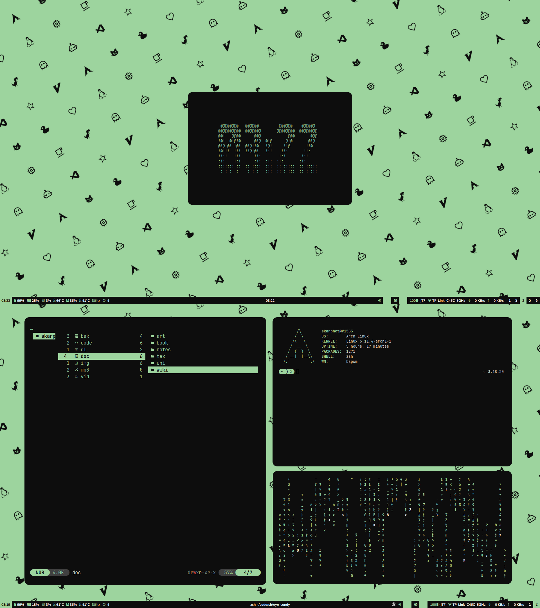
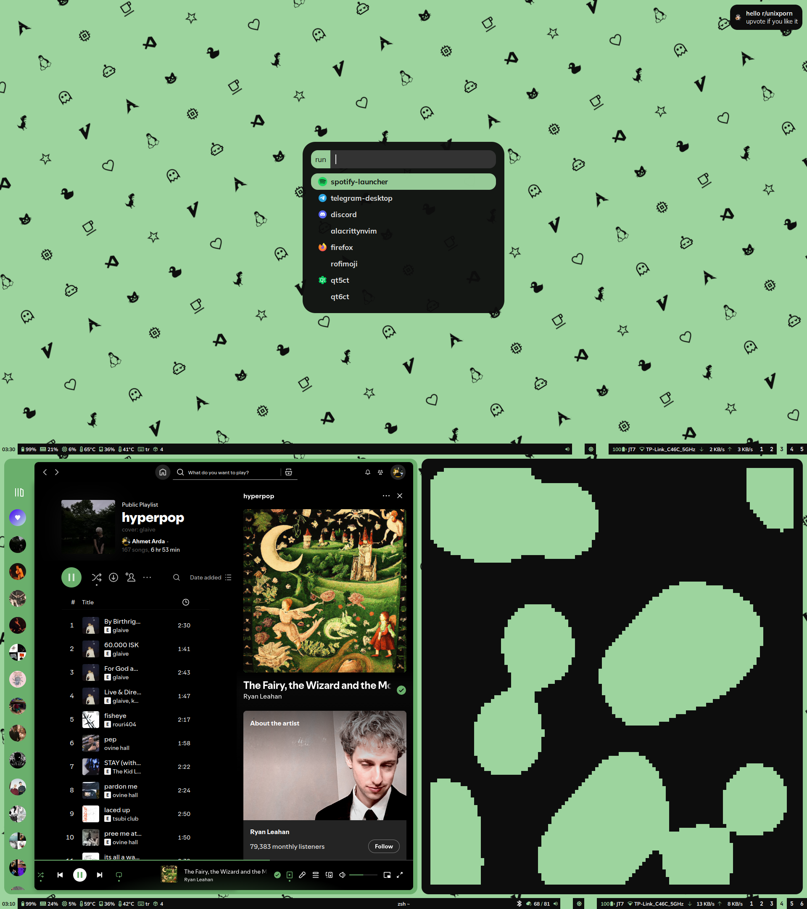

# 🎨 Dotfiles

This repository contains my personal dotfiles for configuring various programs and tools on my Linux system.

## Programs and Tools

- **Terminal**: [Alacritty](https://github.com/alacritty/alacritty)
- **Window Manager**: [BSPWM](https://github.com/baskerville/bspwm)
- **Notification Daemon**: [Dunst](https://dunst-project.org/)
- **Wallpaper Setter**: [Feh](https://github.com/derf/feh)
- **Compositor**: [Picom](https://github.com/yshui/picom)
- **Status Bar**: [Polybar](https://github.com/polybar/polybar)
- **Application Launcher**: [Rofi](https://github.com/davatorium/rofi)
- **Hotkey Daemon**: [Sxhkd](https://github.com/baskerville/sxhkd)
- **File Manager**: [Yazi](https://github.com/sxyazi/yazi)
- **PDF Viewer**: [Zathura](https://pwmt.org/projects/zathura/)
- **Shell**: [Zsh](https://www.zsh.org/)

## Screenshots

 

## Installation

1. **Clone the repository:**

   ```bash
   git clone https://github.com/dybdeskarphet/dotfiles.git
   ```

2. **Move Dotfiles and Modify Them:**

   Navigate to the repository, move the configuration files to their respective locations and modify them according to your needs

3. **Reload Configurations:**

   Restart the programs or re-login to apply the new configurations.

## Additional Notes

- Move `dunst-icons` to `~/.local/share` for default script icons to work.
- Default fonts are:
  - [JetBrains Mono Nerd Font](https://www.nerdfonts.com/font-downloads)
  - [Mulish](https://fonts.google.com/specimen/Mulish)

## License

This project is licensed under the MIT License - see the [LICENSE](LICENSE) file for details.
