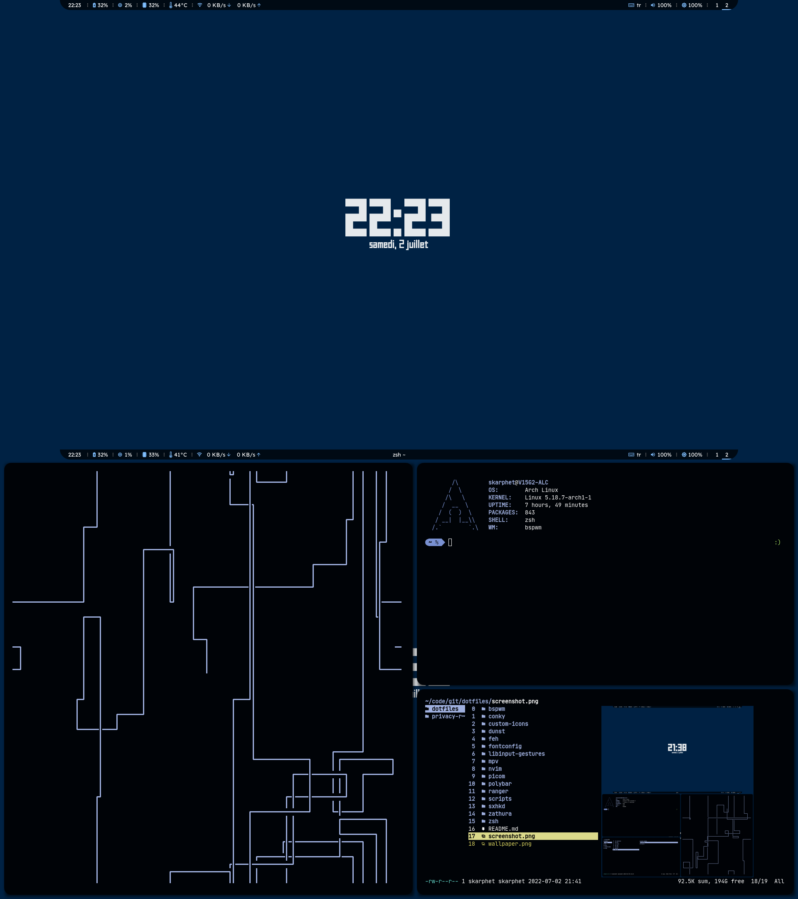

## Before using these dots
- Change `<your username>` strings to your username.
- Move `custom-icons` to `~/.local/share` for default script icons to work.
- My Google Drive [backup script](https://gist.github.com/dybdeskarphet/2235413c182a8f1ee1d14a44592d1ea5) if you use [rclone](https://rclone.org/).
- Download the fonts:
  - [Brick Shapers](https://www.fontspace.com/brickshapers-font-f31281)
  - [JetBrains Mono Nerd Font](https://github.com/ryanoasis/nerd-fonts/tree/master/patched-fonts/JetBrainsMono/Ligatures/Regular/complete)
  - [Readex Pro](https://fonts.google.com/specimen/Readex+Pro)

## Screenshot

 
