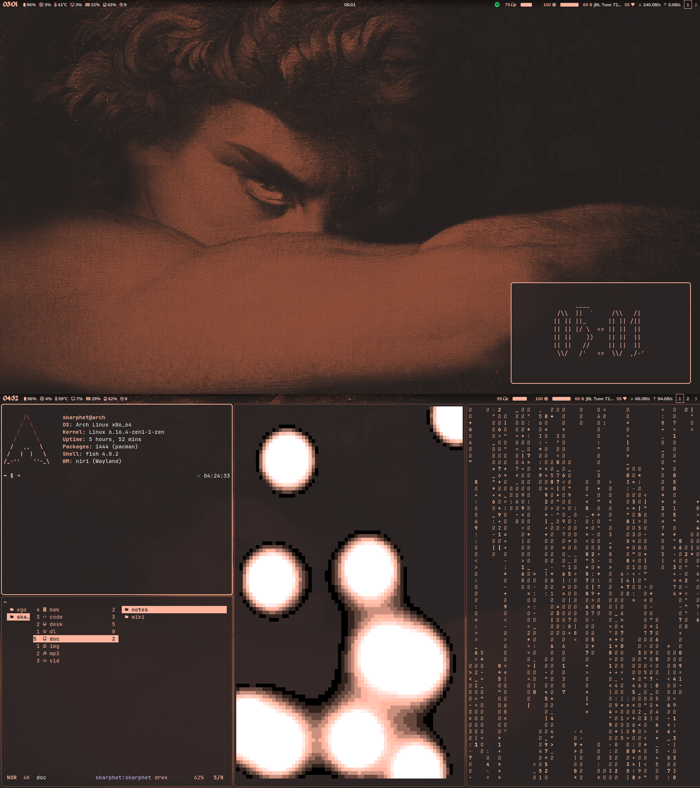

# 🎨 Dotfiles

This repository contains my personal dotfiles for configuring various programs and tools on my Arch Linux system. This branch contains my `hyprland` setup, for my old `bspwm` setup, [click here](https://github.com/dybdeskarphet/dotfiles/tree/bspwm).

## Programs and Tools

- **Wayland Compositor**: [Hyprland](https://hyprland.org/) with [uwsm](https://github.com/Vladimir-csp/uwsm)/[app2unit](https://github.com/Vladimir-csp/app2unit)
- **Terminal**: [foot](https://codeberg.org/dnkl/foot)
- **Notification Daemon**: [Dunst](https://dunst-project.org/)
- **Wallpaper Setter**: [swww](https://github.com/LGFae/swww)
- **Session Lock:** [Hyprlock](https://github.com/hyprwm/hyprlock)
- **Application Launcher**: [Rofi (lbonn's Wayland fork)](https://github.com/lbonn/rofi)
- **PDF Viewer**: [Zathura](https://pwmt.org/projects/zathura/)
- **Shell**: [Zsh](https://www.zsh.org/)
- **File Manager**: [Yazi](https://github.com/sxyazi/yazi)
- **OSD:** [syshud](https://github.com/System64fumo/syshud)

## Screenshots

 

## Installation

1. **Clone the repository:**

   ```bash
   git clone https://github.com/dybdeskarphet/dotfiles.git
   ```

2. **Move Dotfiles and Modify Them:**

   Navigate to the repository, move the configuration files to their respective locations, and modify them according to your preferences.

## Additional Notes

- Custom scripts are located in the `scripts` directory.
- Shaders for Hyprland are available in the `shaders` folder.
- Fonts used:
  - [JetBrains Mono Nerd Font](https://www.nerdfonts.com/font-downloads)
  - [Mulish](https://fonts.google.com/specimen/Mulish)

## License

This project is licensed under the MIT License - see the [LICENSE](LICENSE) file for details.
